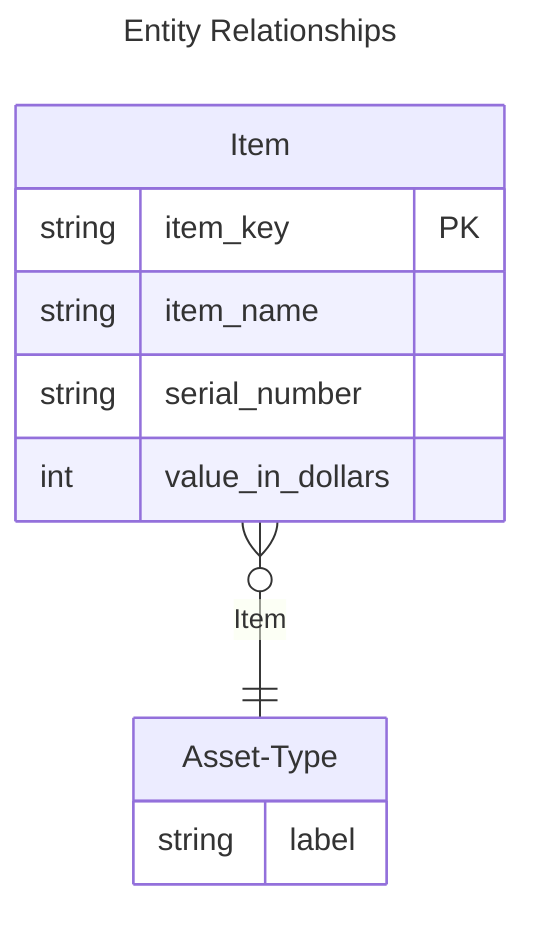

Hi there! In this post we're going to start a small ToDo app programmatically using UIKit written in Objective-C.

```mermaid
---
title: Entity Relationships
---
erDiagram
    Item }o--|| Asset-Type: Item
    Item {
        string item_key PK
        string item_name
        string serial_number
        int value_in_dollars
    }
    Asset-Type {
        string label
    }
```
